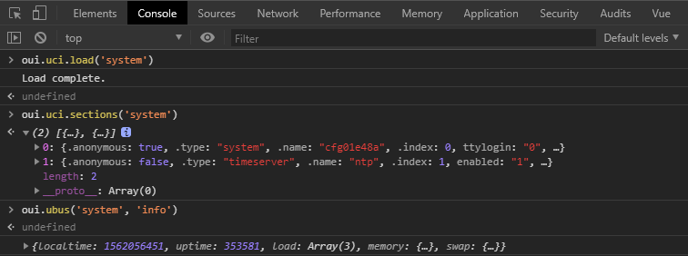
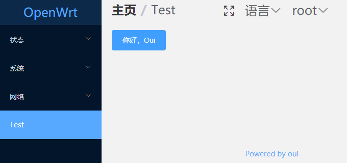
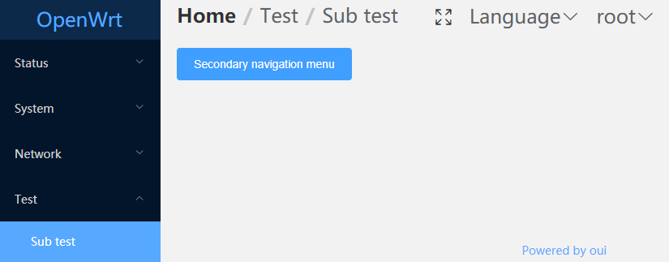

# Getting Started

::: tip
To read this tutorial, developers need to have knowledge of [vue](https://cn.vuejs.org/) and [element-ui](https://element.eleme.io)
:::

## Debugging front-end code

Debugging front-end code is unbearable if we compile it every time we modify it and upload it to the device.

Webpack provides hot update technology. We can make every change displaied on our browser immediately.

1.Install [nodejs](https://nodejs.org)(8.11.0+). You can manage multiple versions of Node on the same machine
with [nvm](https://github.com/creationix/nvm) or [nvm-windows](https://github.com/coreybutler/nvm-windows)

2.Clone the oui code to any location on your development host machine.
``` bash
git clone https://github.com/zhaojh329/oui.git
```

3.Enter：oui/oui-ui-core/src/
``` bash
cd oui/oui-ui-core/src/
```

4.修改代理配置, 将`vue.config.js`里面的`openwrt.lan`更改为你的设备的IP地址

4.Modify the proxy configuration: replace `openwrt.lan` in `vue.config.js` with the IP address of your device.

``` js
module.exports = {
  indexPath: 'oui.html',
  productionSourceMap: false,
  devServer: {
    proxy: {
      '/ubus': {
        target: 'http://openwrt.lan'
      },
      '/cgi-bin/': {
        target: 'http://openwrt.lan'
      }
    }
  }
  ...
}
```

5.Install dependency packages
``` bash
npm insstall
```

6.Start the Debugging Server
``` bash
npm run serve
```

7.According to the output prompt, access the debugging server in the browser. At this point, your code changes will be immediately updated to the browser.

## Web Console Debugging

Webpack builds Vue code in two versions, one for the development version(the debugging described in the previous section is the development version) and the other for the production version.
In the development version, oui exported UCI and UBUS tools for debugging.

Press the F12 shortcut to open the browser's console, where we can query the UCI configuration and call ubus.


## $uci

Oui adds the attribute `$uci` to the Vue instance, which provides a series of methods for manipulating uci.

Refer to the source code for specific usage：`oui/oui-ui-core/src/src/plugins/uci.js`

## $ubus

Oui adds the attribute `$ubus` to the Vue instance, which provides a series of methods for call ubus.

Refer to the source code for specific usage：`oui/oui-ui-core/src/src/plugins/ubus.js`

## String.format

%t
``` js
'%t'.format(13124) === '3h 38m 44s'
```

%m
``` js
'%m'.format(1000) === '1.00 K'
'%M'.format(1024) === '1.00 K'
'%.3m'.format(1100) === '1.100 K'
'%mB'.format(1100) === '1.10 KB'
```

%d
``` js
'%d'.format(10) === '10'
'%d, %d'.format(5, 10) === '5, 10'
'%5d'.format(123) === '  123'
'%-5d'.format(123) === '123  '
'%05d'.format(123) === '00123'
```

%s
``` js
'This is a %s'.format('pen') === 'This is a pen'
'This is %s %s'.format('a', 'pen') === 'This is a pen'
'%5s'.format('abc') === '  abc'
'%-5s'.format('abc') === 'abc  '
```

%o
``` js
'123 => %o'.format(123) === '123 => 173'
'0x7b => %o'.format(0x7b) === '0x7b => 173'
```

%b
``` js
'123 => %b'.format(123) === '123 => 1111011'
'0x7b => %b'.format(0x7b) === '0x7b => 1111011'
```

%x
``` js
'123 => %x'.format(123) === '123 => 7b'
```

%X
``` js
'123 => %X'.format(123) === '123 => 7B'
```

%c
``` js
'%c'.format(97) === 'a'
'%c'.format(0x61) === 'a'
```

%f
``` js
'%f'.format(1.12345) === '1.12345'
'%.2f'.format(1.12345) === '1.12'
```

## How to add a page

### First add the navigation menu

The navigation menu configuration file storage path is：`oui-ui-core/files/usr/share/oui/menu.d`

You can add in an existing menu configuration or create a new file. Navigation menu
is divided into first-level navigation menu and second-level navigation menu.

For example, create a new navigation menu configuration file：`oui-ui-core/files/usr/share/oui/menu.d/test.json`

``` json
{
  "test": {
    "title": "Test",
    "index": 90,
    "view": "test"
  }
}
```
- The first `test` here indicates that the navigation path of the menu is `test`
- `title`: Navigation menu title
- `index`: Used for sorting navigation menus, smaller and closer to the front
- `view`: Vue component path corresponding to navigation menu

### Add pages for the navigation menu just added

Create a very simple Vue component: `oui/oui-ui-core/src/src/views/test.vue`

``` vue
<template>
  <el-button type="primary">Hello，Oui</el-button>
</template>
```

Recompile oui and update it to the device. The results are as follows:


### Secondary navigation menu

``` json
{
  "test": {
    "title": "Test",
    "index": 90
  },
  "test/sub": {
    "title": "Sub test",
    "index": 1,
    "view": "test/sub"
  }
}
```

Delete the previously added `test.Vue` and add a new Vue component：`oui/oui-ui-core/src/src/views/test/sub.vue`

```
<template>
  <el-button type="primary">Secondary navigation menu</el-button>
</template>
```
Recompile oui and update it to the device. The results are as follows:


## How to register UBUS service

All data accessed by oui comes from the `ubus` service provided by the back end. So you have to register `ubus` for your data.

For most of the data, OpenWrt has registered UBUS services for us. If not, we need to register ourselves.

::: tip
For UCI configuration files, OpenWrt's own software package [rpcd](https://openwrt.org/start?id=docs/techref/rpcd) has provided
us with UBUS services to manipulate UCI configuration files.
``` bash
root@OpenWrt:~# ubus -v list uci
'uci' @301dba5a
        "configs":{}
        "get":{"config":"String","section":"String","option":"String","type":"String","match":"Table","ubus_rpc_session":"String"}
        "state":{"config":"String","section":"String","option":"String","type":"String","match":"Table","ubus_rpc_session":"String"}
        "add":{"config":"String","type":"String","name":"String","values":"Table","ubus_rpc_session":"String"}
        "set":{"config":"String","section":"String","type":"String","match":"Table","values":"Table","ubus_rpc_session":"String"}
        "delete":{"config":"String","section":"String","type":"String","match":"Table","option":"String","options":"Array","ubus_rpc_session":"String"}
        "rename":{"config":"String","section":"String","option":"String","name":"String","ubus_rpc_session":"String"}
        "order":{"config":"String","sections":"Array","ubus_rpc_session":"String"}
        "changes":{"config":"String","ubus_rpc_session":"String"}
        "revert":{"config":"String","ubus_rpc_session":"String"}
        "commit":{"config":"String","ubus_rpc_session":"String"}
        "apply":{"rollback":"Boolean","timeout":"Integer","ubus_rpc_session":"String"}
        "confirm":{"ubus_rpc_session":"String"}
        "rollback":{"ubus_rpc_session":"String"}
        "reload_config":{}
```
:::

OpenWrt provides a variety of ways to register UBUS services. An example of a counter is given here. The effect is as follows:
``` bash
root@OpenWrt:~# ubus -v list counter
'counter' @18abaa64
        "get":{}
        "add":{"value":"Integer"}
root@OpenWrt:~# ubus call counter get
{
        "count": 0
}
root@OpenWrt:~# ubus call counter add '{"value": 10}'
{
        "count": 10
}
root@OpenWrt:~# ubus call counter get
{
        "count": 10
}
```

### Mode 1: Call the library provided by UBUS and write an executable program that runs independently.

C
``` C
#include <libubox/blobmsg_json.h>
#include <libubus.h>

static int count;

static int counter_get(struct ubus_context *ctx, struct ubus_object *obj,
		      struct ubus_request_data *req, const char *method,
		      struct blob_attr *msg)
{
	struct blob_buf b = {};
	
	blob_buf_init(&b, 0);

	blobmsg_add_u32(&b, "count", count);
	ubus_send_reply(ctx, req, b.head);
	blob_buf_free(&b);

	return 0;
}

enum {
	COUNTER_VALUE,
	__COUNTER_MAX
};

static const struct blobmsg_policy counter_policy[] = {
	[COUNTER_VALUE] = { .name = "value", .type = BLOBMSG_TYPE_INT32 },
};

static int counter_add(struct ubus_context *ctx, struct ubus_object *obj,
		      struct ubus_request_data *req, const char *method,
		      struct blob_attr *msg)
{
	struct blob_attr *tb[__COUNTER_MAX];
	struct blob_buf b = {};
	
	blobmsg_parse(counter_policy, __COUNTER_MAX, tb, blob_data(msg), blob_len(msg));
	
	if (!tb[COUNTER_VALUE])
		return UBUS_STATUS_INVALID_ARGUMENT;	

	count = blobmsg_get_u32(tb[COUNTER_VALUE]);

	blob_buf_init(&b, 0);

	blobmsg_add_u32(&b, "count", count);
	ubus_send_reply(ctx, req, b.head);
	blob_buf_free(&b);

	return 0;
}

static const struct ubus_method counter_methods[] = {
	UBUS_METHOD_NOARG("get", counter_get),
	UBUS_METHOD("add", counter_add, counter_policy)
};

static struct ubus_object_type counter_object_type =
	UBUS_OBJECT_TYPE("counter", counter_methods);

static struct ubus_object counter_object = {
	.name = "counter",
	.type = &counter_object_type,
	.methods = counter_methods,
	.n_methods = ARRAY_SIZE(counter_methods),
};

int main(int argc, char **argv)
{
	struct ubus_context *ctx;

	uloop_init();

	ctx = ubus_connect(NULL);
	if (!ctx) {
		fprintf(stderr, "Failed to connect to ubus\n");
		return -1;
	}

	ubus_add_uloop(ctx);
	ubus_add_object(ctx, &counter_object);
	uloop_run();

	ubus_free(ctx);
	uloop_done();

	return 0;
}
```

Lua
``` Lua
#!/usr/bin/lua

local ubus = require "ubus"
local uloop = require "uloop"
local count = 0

uloop.init()

local conn = ubus.connect()
if not conn then
	error("Failed to connect to ubus")
end

local methods = {
	counter = {
		get = {
			function(req, msg)
				conn:reply(req, {count = count})
			end, {}
		},
		add = {
			function(req, msg)
				count = msg.value
				conn:reply(req, {count = count})
			end, {value = ubus.INT32 }
		}
	}
}

conn:add(methods)
uloop.run()
```

Mode 2: Write [rpcd](https://openwrt.org/start?Id=docs/techref/rpcd)plugin

Many times, we don't need to open a resident daemon for every UBUS service, so we can register our own UBUS service by adding plugins to rpcd.

  Shell
``` bash
#!/bin/sh
. /usr/share/libubox/jshn.sh

case "$1" in
	list)
		echo '{"get": { }, "add": {"value": 0}}'
	;;
	call)
		case "$2" in
			get)
				[ -f /tmp/counter ] || echo -n 0 > /tmp/counter
				count=$(cat /tmp/counter)
				echo "{ \"count\": $count }"
			;;
			add)
				read input
				json_load $input
				json_get_var add value
				
				[ -f /tmp/counter ] || echo -n 0 > /tmp/counter
				count=$(cat /tmp/counter)
				
				let count=count+$add
				echo -n $count > /tmp/counter
				
				echo "{ \"count\": $count }"
		esac
	;;
esac
```

Lua
``` Lua
#!/usr/bin/lua

local cjson = require("cjson")

local list = {
	get = {},
	add = {value = 0}
}

local function get_count()
	local count = 0
	local f = io.open("/tmp/counter", "r")
	if f  then
		count = f:read("*a")
		f:close()
	else
		os.execute("echo -n 0 > /tmp/counter")
	end
	return count
end

if arg[1] == "list" then
	print(cjson.encode(list))
elseif arg[1] == "call" then
	if arg[2] == "get" then
		local count = get_count()
		print(cjson.encode({count = count}))
	elseif arg[2] == "add" then
		local args = io.read("*a")
		args = cjson.decode(args)
		local count = get_count() + args.value
		os.execute(string.format("echo -n %d > /tmp/counter", count))
		print(cjson.encode({count = count}))
	end
end
```

## Access Data

We show the count value in the example from previous section through the web page and set it up through the web page.

Modify the Vue component added in the previous section：`oui/oui-ui-core/src/src/views/test/sub.vue`
``` vue
<template>
  <div>
    <p>{{ count }}</p>
    <el-button type="primary" @click="add">+</el-button>
  </div>
</template>

<script>
export default {
  data() {
    return {
      count: ''
    }
  },
  created() {
    this.$ubus.call('counter', 'get').then(r => {
      this.count = r.count;
    });
  },
  methods: {
    add() {
      this.$ubus.call('counter', 'add', {value: 1}).then(r => {
        this.count = r.count;
      });
    }
  }
}
</script>
```
Now that our page is not working properly, we need to add permission for the counter UBUS service.

The permission profile storage path is：`oui/oui-ui-core/files/usr/share/rpcd/acl.d`。We can modify the existing permission profile or create a new one.

Let's create a new permission profile here：`oui/oui-ui-core/files/usr/share/rpcd/acl.d/counter`
``` json
{
  "counter": {
    "description": "Counter test",
    "read": {
      "ubus": {
        "counter": ["get"]
      }
    },
    "write": {
      "ubus": {
        "counter": ["add"]
      }
    }
  }
}
```

## Multilingual support

Language file storage path is：`oui/oui-ui-core/src/src/locales`。At present, only English and simplified
Chinese are supported. Add the content you need to translate to the corresponding language file.

Use in Vue template: `$t('content')`
``` vue
<uci-option-input :label="$t('Name')" name="name" required></uci-option-input>
```

Use in JS: `this.$t('content')`
