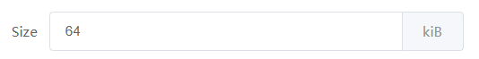

# Components

::: tip
The `self` appearing in the text indicates the current component instance itself.
:::

## uci-form

Represents a uci configuration file. Other components must be wrapped by this component.

### Attributes
| Name      | Description        | Type      | Accepted Values       | Default  |
|---------- |------------ |---------- |-------------|-------- |
| config    | uci configuration file  | string   | — | — |
| tabbed    | Render each uci-section into a tab page | boolean | — | false |
| after-loaded | hook function after uci loading is completed | Function() | — | — |
| apply-timeout | timeout for apply(second) | number |  — | 10 |
| rollback | Whether to enable uci configuration rollback | boolean |  — | true |

### Events
| Name   | Description         | Parameters   |
|---------- |------------- |---------- |
| applied   | triggers when apply configuration complete | — |

## uci-section

Represents a uci section of the same type or a named uci section.

### Attributes
| Name      | Description        | Type      | Accepted Values       | Default  |
|---------- |------------ |---------- |-------------|-------- |
| type    | section type  | string   | — | — |
| Name    | section name  | string   | — | — |
| title    | title  | string   | — | — |
| addable   | Can be added or removed | boolean | — |  false |
| anonymous | Whether it is an anonymous section, if it is false, the add operation will add a named section  | boolean   | — |  true |
| table     | Whether to render into a table | boolean | — |  false |
| sortable  | Support for sorting (valid when table is true) | boolean | — |  false |
| filter    | filter | Function(s, self) | — | — |
| options   | Custom options | object | — | — |
| collabsible | collabsible | boolean | — | true |
| teasers | The name of the option to display when collapsed (all options are displayed by default) | array | — | — |
| add | Custom add function. Return sid or Promise | Function(self) | — | — |
| after-add | hook function after perform add. | Function(sid, self) | — | — |
| before-del | hook function before perform delete. If false is returned or a Promise is returned and then is rejected, deletes will be prevented | Function(sid, self) | — | — |

### Filter

Suppose there is such a uci configuration file: test
```
config item
    option name qa
    option age 32
config item
    option name qa
    option age 18
```
Require only showing items older than 30:
``` vue
<template>
  <uci-form config="test">
    <uci-section type="item" :filter="filter">
    ...
    </uci-section>
  </uci-form>
</template>

<script>
export default {
  methods: {
    filter(s) {
      return s.age > 30;
    }
  }
}
</script>
```

### Custom add function

Returns the added section ID or Promise object.

Suppose there is such a uci configuration file: test
```
config item
    option name qa
    option age 32
```
The name option is required to be entered by the user when adding a section, and cannot be repeated, and cannot be modified once added.
``` vue
<template>
  <uci-form config="test" addable :add="addItem">
    <uci-section type="item" :filter="filter">
      <uci-option-dummy label="Name" name="name"></uci-option-dummy>
    </uci-section>
  </uci-form>
</template>

<script>
export default {
  methods: {
    addItem() {
      return new Promise(resolve => {
        this.$prompt('Please input a name', 'add', {
          inputValidator: value => {
            if (!value)
              return true;
      
            const sections = self.sections;
            for (let i = 0; i < sections.length; i++)
              if (sections[i].name === value)
                return 'The name already exist';
      
            return true;
          }
        }).then(r => {
          if (!r.value)
            return;
      
          const sid = this.$uci.add('test', 'item');
          this.$uci.set('test', sid, 'name', r.value);
          resolve(sid);
        });
      });
    }
  }
}
</script>
```

## uci-tab

Wrap the uci option in the Tab tab

### Attributes
| Name    | Description        | Type      | Accepted Values       | Default  |
|-------- |------------ |---------- |-------------|-------- |
| title   | title | string | — | — |
| Name    | identifier corresponding to the name of Tabs, representing the alias of the tab-pane | string | — | — |

## uci-option

All properties of the `uci-option` component are inherited by other `uci-option-xx` components.

### Attributes
| Name        | Description        | Type      | Accepted Values       | Default  |
|------------ |------------ |---------- |-------------|-------- |
| label       | label | string | — | — |
| name        | option name (under the same section, must be unique) | string | — | — |
| uci-option  | Uci option name (if this attribute is provided, the name attribute is no longer used as the uci option name) | string | — | — |
| description | a short description of the option(Support for HTML rendering) | string | — | — |
| required    | Required or not | boolean | — | false |
| initial     | initial value | string/number | — | — |
| depend      | depend | string | — | — |
| rules       | form validation rule | string/object/Function(value) | — | — |
| load        | Custom loading method | string/array/Function(sid, self) | — | — |
| save        | Custom save function or value(If an empty string provided, indicates don't save uci) | string/array/Function(sid, value, self) | — | — |
| apply       | hook function when submitting a form | Function(value, self) | — | — |
| tab         | Specify the tab panel to which this option belongs | string | — | — |
| header      | Custom table column header | string | — | — |
| width       | Column width of the table | string/number | — | — |
| hide        | Do not show | boolean | — | — |

### Events
| Name   | Description         | Parameters   |
|---------- |------------- |---------- |
| applied   | triggers when apply configuration complete | The current value of this option |
| change    | triggers when the option's value changed | value, sid, self |

### Scoped Slots
| Name | Description     |
|------|----------|
| —    | Custom option content, the parameter is {sid, prop, value, self} |

### Custom option loading method

Implemented by providing the `load` attribute. This property supports three types of strings, arrays, and functions.
If you provide a function, you can return a value directly or a Promise object. If you supply a string or an array,
you can dynamically update the value of this option.
``` vue
<uci-option-switch label="X" name="x" :load="xEnabled"></uci-option-switch>
...
<script>
export default {
  methods: {
    xEnabled() {
      return new Promise(resolve => {
        let en = false
        // TODO
        resolve(en);
      });
    }
  }
}
</script>  
```

### Custom save function

Implemented by providing the `save` attribute. This property supports both string and function types.
If a string is provided, it means that uci is not saved for this option.
If a function is provided, a Promise object can be returned for asynchronous save.

### Custom option UI

``` vue
<uci-option label="名称" name="name">
  <template v-slot="props">
    <span>{{ props.value }}</span>
  </template>
</uci-option>
```
Equivalent to
``` vue
<uci-option-dummy label="名称" name="name"></uci-option-dummy>
```

``` vue
<uci-option label="名称" name="name">
  <template v-slot="props">
    <el-input v-model="props.self.form[props.prop]"></el-input>
  </template>
</uci-option>
```
Equivalent to
``` vue
<uci-option-input label="名称" name="name"></uci-option-input>
```

## uci-option-dummy

Used only to display values, not for editing.

### Attributes
| Name        | Description        | Type      | Accepted Values       | Default  |
|------------ |------------ |---------- |-------------|-------- |

## uci-option-input

Used for editable uci options.

### Attributes
| Name        | Description        | Type      | Accepted Values       | Default  |
|------------ |------------ |---------- |-------------|-------- |
| placeholder | placeholder | string | — | — |
| password | toggleable password input | boolean | — | false |
| append | content to append after Input | string | — | — |
| suggestions | recommended tips | array | — | — |
| minlength | same as minlength in native input | number | — | — |
| maxlength | same as maxlength in native input | number | — | — |

### content to append after Input

For example, some options require adding a unit after the input box.

``` vue
<uci-option-input label="Size" name="size" append="kiB"></uci-option-input>
```

## uci-option-switch

Used for options with a switch state.

### Attributes
| Name           | Description        | Type      | Accepted Values       | Default  |
|--------------- |------------ |---------- |-------------|-------- |
| initial        | initial value | string/number/boolean | — | — |
| active-value   | switch value when in on state | string/number/boolean | — | true |
| inactive-value | switch value when in off state | string/number/boolean | — | false |

## uci-option-list

Used when an option has multiple optional values.

### Attributes
| Name        | Description        | Type      | Accepted Values       | Default  |
|------------ |------------ |---------- |-------------|-------- |
| initial | initial value | string/number/array | — | — |
| options | optional list value | array | — | —  |
| multiple | whether multiple-select is activated | boolean | — | false |
| allow-create | whether creating new items is allowed | boolean | — | false |
| exclude | Exclude value in the list | string/Function(sid, self) | — | — |

## uci-option-dlist

Dynamic list. Corresponds to the list in the uci configuration.

### Attributes
| Name        | Description        | Type      | Accepted Values       | Default  |
|------------ |------------ |---------- |-------------|-------- |
| initial | initial value | array | — | — |
| suggestions | recommended tips | array | — | — |

## uci-option-file

Similar to the input box, but support for select file.
