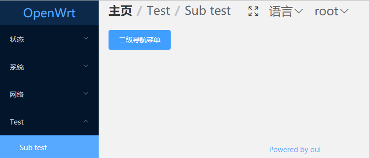

# 快速上手

::: tip
阅读本教程，需要开发者具备[vue](https://cn.vuejs.org/)和[element-ui](https://element.eleme.io)知识
:::

## 调试前端代码

如果我们每修改一次代码，就编译一次，然后上传到设备，这样的开发效率实在是无法忍受。

Webpack提供了热更新技术。可使我们的每一次修改，都能立即呈现在浏览器上。

1.安装[nodejs](https://nodejs.org)(8.11.0+)。你可以使用[nvm](https://github.com/creationix/nvm)
或[nvm-windows](https://github.com/coreybutler/nvm-windows) 在同一台电脑中管理多个Node版本。

2.克隆oui代码到你的开发主机的任意位置
``` bash
git clone https://github.com/zhaojh329/oui.git
```

3.进入：oui/oui-ui-core/src/
``` bash
cd oui/oui-ui-core/src/
```

4.修改代理配置, 将`vue.config.js`里面的`openwrt.lan`更改为你的设备的IP地址
``` js
module.exports = {
  indexPath: 'oui.html',
  productionSourceMap: false,
  devServer: {
    proxy: {
      '/ubus': {
        target: 'http://openwrt.lan'
      },
      '/cgi-bin/': {
        target: 'http://openwrt.lan'
      }
    }
  }
  ...
}
```

5.安装依赖包
``` bash
npm install
```

6.启动调试服务器
``` bash
npm run serve
```

7.根据输出提示，在浏览器中访问调试服务器。这时，你对代码的修改，都会立即更新到浏览器上面。

## Web控制台调试

Webpack在构建vue代码时，分两个版本，一个为开发版本(上节介绍的调试即为开发版本)，一个为生产版本。在开发版本中，oui导出了用于调试的uci和ubus工具。

按F12快捷键打开浏览器的控制台，我们可以在控制台中查询uci配置以及调用ubus。


## $uci

oui给Vue实例添加了属性`$uci`，该属性提供了用于操作uci的方法。

具体用法请参考源码：`oui/oui-ui-core/src/src/plugins/uci.js`

## $ubus

oui给Vue实例添加了属性`$ubus`，该属性提供了用于调用ubus的方法。

具体用法请参考源码：`oui/oui-ui-core/src/src/plugins/ubus.js`

## String.format

%t
``` js
'%t'.format(13124) === '3h 38m 44s'
```

%m
``` js
'%m'.format(1000) === '1.00 K'
'%M'.format(1024) === '1.00 K'
'%.3m'.format(1100) === '1.100 K'
'%mB'.format(1100) === '1.10 KB'
```

%d
``` js
'%d'.format(10) === '10'
'%d, %d'.format(5, 10) === '5, 10'
'%5d'.format(123) === '  123'
'%-5d'.format(123) === '123  '
'%05d'.format(123) === '00123'
```

%s
``` js
'This is a %s'.format('pen') === 'This is a pen'
'This is %s %s'.format('a', 'pen') === 'This is a pen'
'%5s'.format('abc') === '  abc'
'%-5s'.format('abc') === 'abc  '
```

%o
``` js
'123 => %o'.format(123) === '123 => 173'
'0x7b => %o'.format(0x7b) === '0x7b => 173'
```

%b
``` js
'123 => %b'.format(123) === '123 => 1111011'
'0x7b => %b'.format(0x7b) === '0x7b => 1111011'
```

%x
``` js
'123 => %x'.format(123) === '123 => 7b'
```

%X
``` js
'123 => %X'.format(123) === '123 => 7B'
```

%c
``` js
'%c'.format(97) === 'a'
'%c'.format(0x61) === 'a'
```

%f
``` js
'%f'.format(1.12345) === '1.12345'
'%.2f'.format(1.12345) === '1.12'
```

## 如何添加一个页面

### 首先添加导航菜单

导航菜单配置文件存储路径为：`oui-ui-core/files/usr/share/oui/menu.d`

你可以在已有的菜单配置文件里面添加或者新建一个文件。导航菜单分为一级导航菜单和二级导航菜单。

比如新建一个导航菜单配置文件：`oui-ui-core/files/usr/share/oui/menu.d/test.json`

``` json
{
  "test": {
    "title": "Test",
    "index": 90,
    "view": "test"
  }
}
```

- 这里的第一个`test`表示菜单的导航路径为`/test`
- `title`: 导航菜单标题
- `index`: 用于导航菜单排序，越小越靠前
- `view`: 导航菜单对应的vue组件路径

### 为刚刚添加的导航菜单添加页面

创建一个非常简单的Vue组件: `oui/oui-ui-core/src/src/views/test.vue`

```
<template> vue
  <el-button type="primary">你好，Oui</el-button>
</template>
```

重新编译oui并更新到设备。效果如下：


### 二级导航菜单

``` json
{
  "test": {
    "title": "Test",
    "index": 90
  },
  "test/sub": {
    "title": "Sub test",
    "index": 1,
    "view": "test/sub"
  }
}
```

将之前添加的test.vue删除，并添加新的vue组件：`oui/oui-ui-core/src/src/views/test/sub.vue`

```
<template>
  <el-button type="primary">二级导航菜单</el-button>
</template>
```
重新编译oui并更新到设备。效果如下：


## 如何注册ubus服务

oui存取的所有数据均来自于后端提供的`ubus`服务。因此你必须为你的数据注册`ubus`服务。

对于大多数数据，OpenWrt已经为我们注册了ubus服务，如果没有，就需要我们自己注册。

::: tip
对于uci配置文件，OpenWrt自带软件包rpcd已经为我们提供了ubus服务，供我们操作uci配置文件。
``` bash
root@OpenWrt:~# ubus -v list uci
'uci' @301dba5a
        "configs":{}
        "get":{"config":"String","section":"String","option":"String","type":"String","match":"Table","ubus_rpc_session":"String"}
        "state":{"config":"String","section":"String","option":"String","type":"String","match":"Table","ubus_rpc_session":"String"}
        "add":{"config":"String","type":"String","name":"String","values":"Table","ubus_rpc_session":"String"}
        "set":{"config":"String","section":"String","type":"String","match":"Table","values":"Table","ubus_rpc_session":"String"}
        "delete":{"config":"String","section":"String","type":"String","match":"Table","option":"String","options":"Array","ubus_rpc_session":"String"}
        "rename":{"config":"String","section":"String","option":"String","name":"String","ubus_rpc_session":"String"}
        "order":{"config":"String","sections":"Array","ubus_rpc_session":"String"}
        "changes":{"config":"String","ubus_rpc_session":"String"}
        "revert":{"config":"String","ubus_rpc_session":"String"}
        "commit":{"config":"String","ubus_rpc_session":"String"}
        "apply":{"rollback":"Boolean","timeout":"Integer","ubus_rpc_session":"String"}
        "confirm":{"ubus_rpc_session":"String"}
        "rollback":{"ubus_rpc_session":"String"}
        "reload_config":{}
```
:::

OpenWrt提供了多种方式，用来注册ubus服务。这里给出了一个计数器的例子,效果如下：
``` bash
root@OpenWrt:~# ubus -v list counter
'counter' @18abaa64
        "get":{}
        "add":{"value":"Integer"}
root@OpenWrt:~# ubus call counter get
{
        "count": 0
}
root@OpenWrt:~# ubus call counter add '{"value": 10}'
{
        "count": 10
}
root@OpenWrt:~# ubus call counter get
{
        "count": 10
}
```

### 方式1: 调用ubus提供的库，编写独立运行的可执行程序。

C语言版本
``` C
#include <libubox/blobmsg_json.h>
#include <libubus.h>

static int count;

static int counter_get(struct ubus_context *ctx, struct ubus_object *obj,
		      struct ubus_request_data *req, const char *method,
		      struct blob_attr *msg)
{
	struct blob_buf b = {};
	
	blob_buf_init(&b, 0);

	blobmsg_add_u32(&b, "count", count);
	ubus_send_reply(ctx, req, b.head);
	blob_buf_free(&b);

	return 0;
}

enum {
	COUNTER_VALUE,
	__COUNTER_MAX
};

static const struct blobmsg_policy counter_policy[] = {
	[COUNTER_VALUE] = { .name = "value", .type = BLOBMSG_TYPE_INT32 },
};

static int counter_add(struct ubus_context *ctx, struct ubus_object *obj,
		      struct ubus_request_data *req, const char *method,
		      struct blob_attr *msg)
{
	struct blob_attr *tb[__COUNTER_MAX];
	struct blob_buf b = {};
	
	blobmsg_parse(counter_policy, __COUNTER_MAX, tb, blob_data(msg), blob_len(msg));
	
	if (!tb[COUNTER_VALUE])
		return UBUS_STATUS_INVALID_ARGUMENT;	

	count = blobmsg_get_u32(tb[COUNTER_VALUE]);

	blob_buf_init(&b, 0);

	blobmsg_add_u32(&b, "count", count);
	ubus_send_reply(ctx, req, b.head);
	blob_buf_free(&b);

	return 0;
}

static const struct ubus_method counter_methods[] = {
	UBUS_METHOD_NOARG("get", counter_get),
	UBUS_METHOD("add", counter_add, counter_policy)
};

static struct ubus_object_type counter_object_type =
	UBUS_OBJECT_TYPE("counter", counter_methods);

static struct ubus_object counter_object = {
	.name = "counter",
	.type = &counter_object_type,
	.methods = counter_methods,
	.n_methods = ARRAY_SIZE(counter_methods),
};

int main(int argc, char **argv)
{
	struct ubus_context *ctx;

	uloop_init();

	ctx = ubus_connect(NULL);
	if (!ctx) {
		fprintf(stderr, "Failed to connect to ubus\n");
		return -1;
	}

	ubus_add_uloop(ctx);
	ubus_add_object(ctx, &counter_object);
	uloop_run();

	ubus_free(ctx);
	uloop_done();

	return 0;
}
```

Lua版本
``` Lua
#!/usr/bin/lua

local ubus = require "ubus"
local uloop = require "uloop"
local count = 0

uloop.init()

local conn = ubus.connect()
if not conn then
	error("Failed to connect to ubus")
end

local methods = {
	counter = {
		get = {
			function(req, msg)
				conn:reply(req, {count = count})
			end, {}
		},
		add = {
			function(req, msg)
				count = msg.value
				conn:reply(req, {count = count})
			end, {value = ubus.INT32 }
		}
	}
}

conn:add(methods)
uloop.run()
```

方式2: 编写[rpcd](https://openwrt.org/start?id=docs/techref/rpcd)插件

很多时候，我们没必要为每一个ubus服务开启一个常驻的daemon，这时我们可以通过给rpcd添加插件的方式来注册我们自己的ubus服务。

  Shell
``` bash
#!/bin/sh
. /usr/share/libubox/jshn.sh

case "$1" in
	list)
		echo '{"get": { }, "add": {"value": 0}}'
	;;
	call)
		case "$2" in
			get)
				[ -f /tmp/counter ] || echo -n 0 > /tmp/counter
				count=$(cat /tmp/counter)
				echo "{ \"count\": $count }"
			;;
			add)
				read input
				json_load $input
				json_get_var add value
				
				[ -f /tmp/counter ] || echo -n 0 > /tmp/counter
				count=$(cat /tmp/counter)
				
				let count=count+$add
				echo -n $count > /tmp/counter
				
				echo "{ \"count\": $count }"
		esac
	;;
esac
```

Lua
``` Lua
#!/usr/bin/lua

local cjson = require("cjson")

local list = {
	get = {},
	add = {value = 0}
}

local function get_count()
	local count = 0
	local f = io.open("/tmp/counter", "r")
	if f  then
		count = f:read("*a")
		f:close()
	else
		os.execute("echo -n 0 > /tmp/counter")
	end
	return count
end

if arg[1] == "list" then
	print(cjson.encode(list))
elseif arg[1] == "call" then
	if arg[2] == "get" then
		local count = get_count()
		print(cjson.encode({count = count}))
	elseif arg[2] == "add" then
		local args = io.read("*a")
		args = cjson.decode(args)
		local count = get_count() + args.value
		os.execute(string.format("echo -n %d > /tmp/counter", count))
		print(cjson.encode({count = count}))
	end
end
```

## 存取数据

我们通过网页来展示上节示例中的count值，并通过网页设置。

修改前面章节添加的vue组件：`oui/oui-ui-core/src/src/views/test/sub.vue`
``` vue
<template>
  <div>
    <p>{{ count }}</p>
    <el-button type="primary" @click="add">+</el-button>
  </div>
</template>

<script>
export default {
  data() {
    return {
      count: ''
    }
  },
  created() {
    this.$ubus.call('counter', 'get').then(r => {
      this.count = r.count;
    });
  },
  methods: {
    add() {
      this.$ubus.call('counter', 'add', {value: 1}).then(r => {
        this.count = r.count;
      });
    }
  }
}
</script>
```

现在我们的页面还无法正常工作，我们还需要给counter这个ubus服务注册权限。

权限配置文件存储路径为：`oui/oui-ui-core/files/usr/share/rpcd/acl.d`。我们可以在现有的权限配置文件中修改，或者新建一个权限配置文件。

我们这里新建一个权限配置文件：`oui/oui-ui-core/files/usr/share/rpcd/acl.d/counter`
``` json
{
  "counter": {
    "description": "Counter test",
    "read": {
      "ubus": {
        "counter": ["get"]
      }
    },
    "write": {
      "ubus": {
        "counter": ["add"]
      }
    }
  }
}
```

## 多语言支持

语言文件存储路径为：`oui/oui-ui-core/src/src/locales`。目前仅支持英文和简体中文。把你需要翻译的内容添加到对应的语言文件中。

在vue模板中使用`$t('content')`
``` vue
<uci-option-input :label="$t('Name')" name="name" required></uci-option-input>
```

在js中使用`this.$t('content')`
