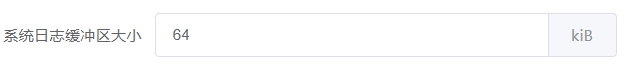

# 组件

::: tip
文中出现的`self`均表示当前组件实例本身。
:::

## uci-form

代表一个uci配置文件。其它组件必须由该组件包裹。

### 属性
| 名称      | 说明        | 类型      | 可选值       | 默认值  |
|---------- |------------ |---------- |-------------|-------- |
| config    | uci配置文件  | string   | — | — |
| tabbed    | 将每个uci-section渲染成Tab标签页 | boolean | — | false |
| after-loaded | uci配置加载完成后的钩子 | Function() | — | — |
| apply-timeout | 应用超时时间(秒) | number |  — | 10 |
| rollback | 是否开启uci配置回滚 | boolean |  — | true |

### 事件
| 事件名称   | 说明         | 回调参数   |
|---------- |------------- |---------- |
| applied     | 当应用配置完成时触发 | — |

## uci-section

代表具有同一类型的uci section或者某个命名的uci section。

### 属性
| 名称      | 说明        | 类型      | 可选值       | 默认值  |
|---------- |------------ |---------- |-------------|-------- |
| type    | section类型  | string   | — | — |
| name    | section名称  | string   | — | — |
| title    | 标题  | string   | — | — |
| addable   | 是否可以添加或者删除 | boolean | — |  false |
| anonymous | 是否是匿名section，若为false，添加操作将添加一个命名section  | boolean   | — |  true |
| table     | 是否渲染成一个表格 | boolean | — |  false |
| sortable  | 是支持排序(table为true时有效) | boolean | — |  false |
| filter    | 过滤 | Function(s, self) | — | — |
| options   | 自定义选项 | object | — | — |
| collabsible | 是否可折叠 | boolean | — | true |
| teasers | 折叠时需要显示的选项名称(默认显示所有选项) | array | — | — |
| add | 自定义添加函数。返回sid或者Promise | Function(self) | — | — |
| after-add | 执行添加后的钩子 | Function(sid, self) | — | — |
| before-del | 执行删除前的钩子,若返回 false 或者返回 Promise 且被 reject，则阻止删除 | Function(sid, self) | — | — |

### 过滤

通过`filter`属性可实现过滤。该属性类型为一个函数，返回boolean值。

假设有这样一个uci配置文件：test
```
config item
    option name qa
    option age 32
config item
    option name qa
    option age 18
```
要求只展示年龄大于30的item:
``` vue
<template>
  <uci-form config="test">
    <uci-section type="item" :filter="filter">
    ...
    </uci-section>
  </uci-form>
</template>

<script>
export default {
  methods: {
    filter(s) {
      return s.age > 30;
    }
  }
}
</script>
```

### 自定义添加

通过`add`属性可实现自定义添加功能。该属性类型为一个函数，返回添加的section ID或者Promise对象。

假设有这样一个uci配置文件：test
```
config item
    option name qa
    option age 32
```
要求其中的name选项在添加section时由用户输入，并且不能重复，而且一旦添加就不能修改。
``` vue
<template>
  <uci-form config="test" addable :add="addItem">
    <uci-section type="item" :filter="filter">
      <uci-option-dummy label="名称" name="name"></uci-option-dummy>
    </uci-section>
  </uci-form>
</template>

<script>
export default {
  methods: {
    addItem() {
      return new Promise(resolve => {
        this.$prompt('请输入名称', '添加', {
          inputValidator: value => {
            if (!value)
              return true;
      
            const sections = self.sections;
            for (let i = 0; i < sections.length; i++)
              if (sections[i].name === value)
                return '名称已存在';
      
            return true;
          }
        }).then(r => {
          if (!r.value)
            return;
      
          const sid = this.$uci.add('test', 'item');
          this.$uci.set('test', sid, 'name', r.value);
          resolve(sid);
        });
      });
    }
  }
}
</script>
```

## uci-tab

将uci选项包裹在Tab标签页中

### 属性
| 名称    | 说明        | 类型      | 可选值       | 默认值  |
|-------- |------------ |---------- |-------------|-------- |
| title   | 标题 | string | — | — |
| name    | 唯一标识 | string | — | — |

## uci-option

`uci-option`组件的所有属性被其它`uci-option-xx`组件所继承。

### 属性
| 名称        | 说明        | 类型      | 可选值       | 默认值  |
|------------ |------------ |---------- |-------------|-------- |
| label       | 标签 | string | — | — |
| name        | 名称 | string | — | — |
| uci-option  | uci选项名称(如果提供该属性，则不再以name属性作为uci选项名称) | string | — | — |
| description | 对该选项的一个简短描述(支持渲染HTML) | string | — | — |
| required    | 是否必填 | boolean | — | false |
| initial     | 初始值 | string/number | — | — |
| depend      | 依赖 | string | — | — |
| rules       | 表单验证规则 | string/object/Function(value) | — | — |
| load        | 自定义加载方式 | string/array/Function(sid, self) | — | — |
| save        | 自定义保存函数或者值(如果提供一个空字符串，表示不保存) | string/array/Function(sid, value, self) | — | — |
| apply       | 表单提交时的钩子函数 | Function(value, self) | — | — |
| tab         | 明确指定该选项所属的Tab面板 | string | — | — |
| header      | 自定义表格的列标题 | string | — | — |
| width       | 表格的列宽度 | string/number | — | — |
| hide        | 不显示 | boolean | — | — |

### 事件
| 事件名称   | 说明         | 回调参数   |
|---------- |------------- |---------- |
| applied   | 当应用配置完成时触发 | 该选项的当前值 |
| change    | 当选项的值改变时触发 | value, sid, self |

### 作用域插槽
| 名称 | 说明     |
|------|----------|
| —    |自定义选项内容，参数为 {sid, prop, value, self} |

### 自定义选项加载方式。

通过提供`load`属性实现。该属性支持字符串，数组，函数三种类型。如果提供一个函数，可直接返回一个值或者Promise对象。如果提供一个字符串或者数组，可动态更新该选项的值。
``` vue
<uci-option-switch label="测试" name="x" :load="xEnabled"></uci-option-switch>
...
<script>
export default {
  methods: {
    xEnabled() {
      return new Promise(resolve => {
        let en = false
        // TODO
        resolve(en);
      });
    }
  }
}
</script>  
```

### 自定义保存函数

通过提供`save`属性实现。该属性支持字符串和函数两种类型。如果提供一个字符串，表示不对该选项执行uci的保存操作。
如果提供一个函数，可返回一个Promise对象实现异步保存。

### 自定义选项UI

通过默认作用域插槽实现。
``` vue
<uci-option label="名称" name="name">
  <template v-slot="props">
    <span>{{ props.value }}</span>
  </template>
</uci-option>
```
等价于
``` vue
<uci-option-dummy label="名称" name="name"></uci-option-dummy>
```

``` vue
<uci-option label="名称" name="name">
  <template v-slot="props">
    <el-input v-model="props.self.form[props.prop]"></el-input>
  </template>
</uci-option>
```
等价于
``` vue
<uci-option-input label="名称" name="name"></uci-option-input>
```

## uci-option-dummy

仅用于显示值，不能编辑。

### 属性
| 名称        | 说明        | 类型      | 可选值       | 默认值  |
|------------ |------------ |---------- |-------------|-------- |

## uci-option-input

用于可编辑的uci选项。

### 属性
| 名称        | 说明        | 类型      | 可选值       | 默认值  |
|------------ |------------ |---------- |-------------|-------- |
| placeholder | 占位符 | string | — | — |
| password | 密码框 | boolean | — | false |
| append | 输入框后置内容 | string | — | — |
| suggestions | 输入建议选项 | array | — | — |
| maxlength | 原生属性，最大输入长度 | number | — | — |
| minlength | 原生属性，最小输入长度 | number | — | — |

### 输入框后置内容

比如某些选项需要在输入框后面添加一个单位。

``` vue
<uci-option-input label="系统日志缓冲区大小" name="log_size" append="kiB"></uci-option-input>
```

## uci-option-switch

用于具有开关状态的选项。

### 属性
| 名称           | 说明        | 类型      | 可选值       | 默认值  |
|--------------- |------------ |---------- |-------------|-------- |
| initial        | 初始值 | string/number/boolean | — | — |
| active-value   | switch打开时的值 | string/number/boolean | — | true |
| inactive-value | switch关闭时的值 | string/number/boolean | — | false |

## uci-option-list

用于一个选项具有多个可选值的情况。

### 属性
| 名称        | 说明        | 类型      | 可选值       | 默认值  |
|------------ |------------ |---------- |-------------|-------- |
| initial | 初始值 | string/number/array | — | — |
| options | 可选列表值 | array | — | —  |
| multiple | 多选 | boolean | — | false |
| allow-create | 是否允许用户创建新条目 | boolean | — | false |
| exclude | 排除列表中的值 | string/Function(sid, self) | — | — |

## uci-option-dlist

动态列表。对应uci配置里面的list。

### 属性
| 名称        | 说明        | 类型      | 可选值       | 默认值  |
|------------ |------------ |---------- |-------------|-------- |
| initial | 初始值 | array | — | — |
| suggestions | 输入建议选项 | array | — | — |

## uci-option-file

类似输入框，但是支持选择文件。
